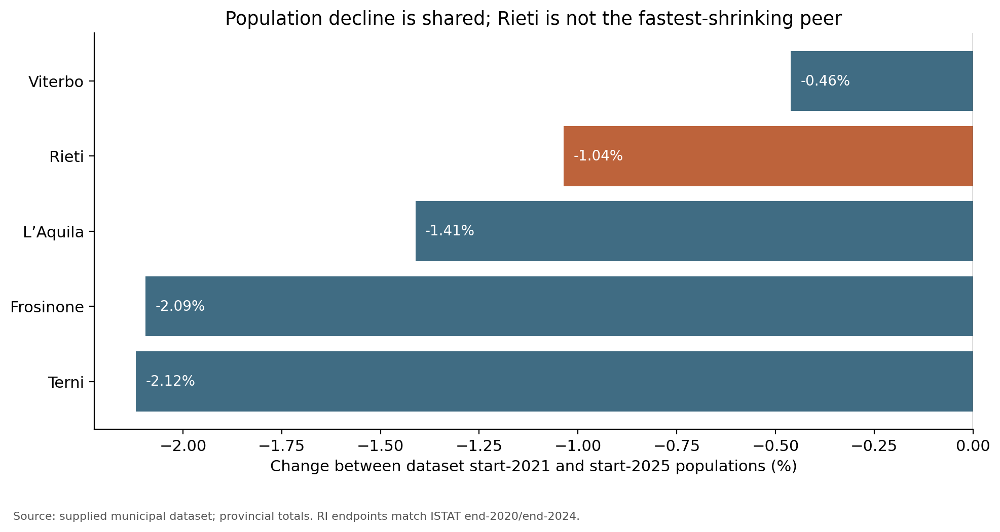
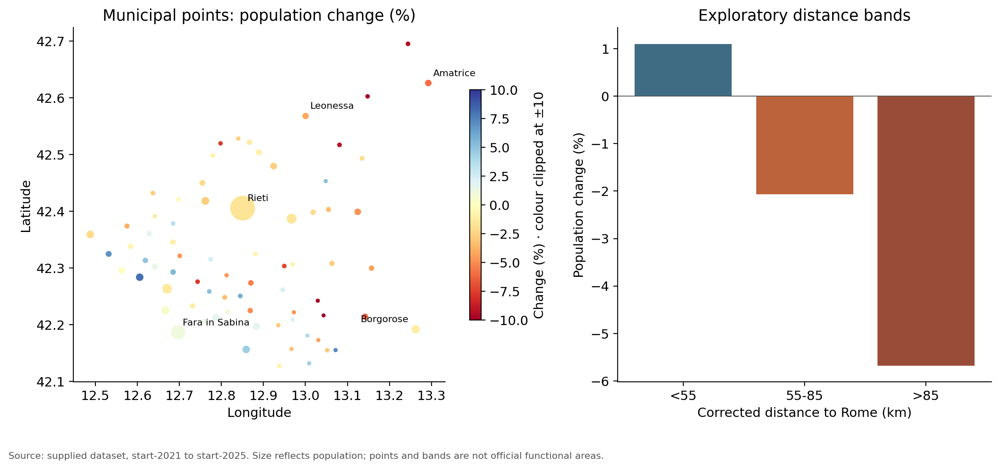
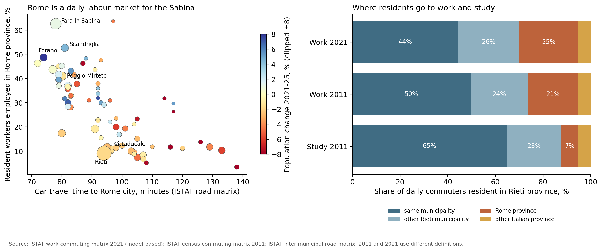
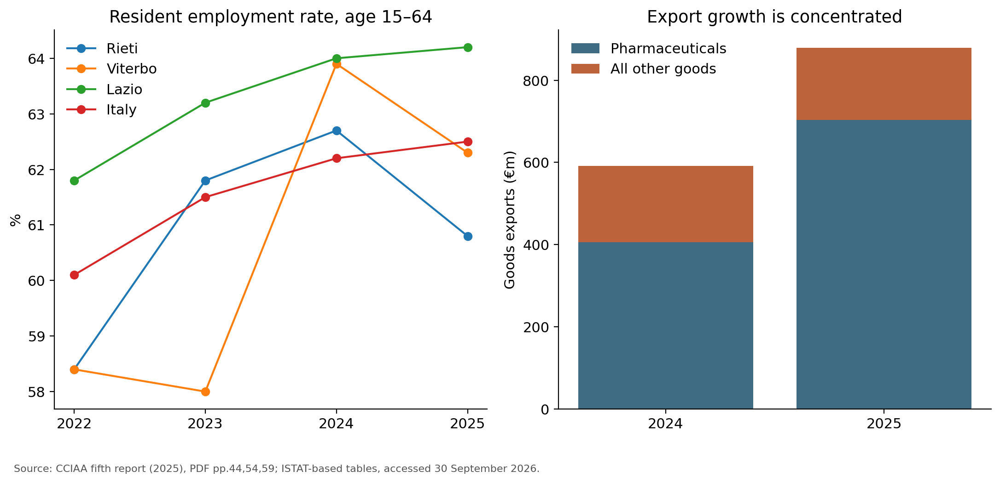
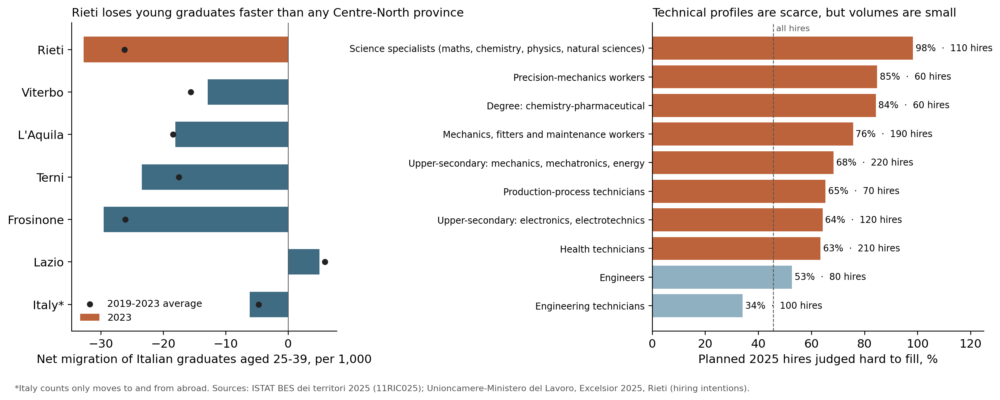
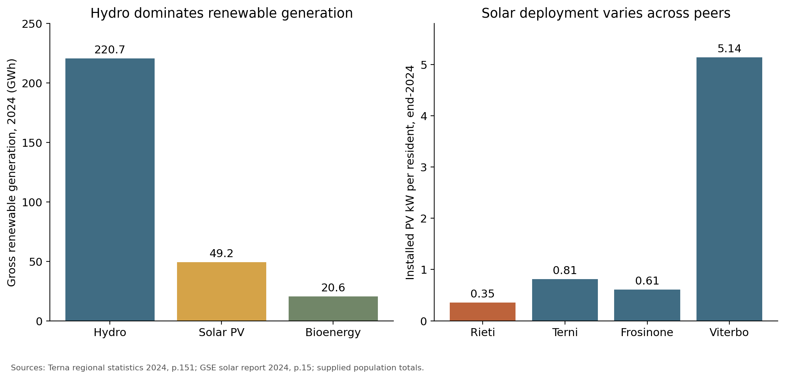

# Rieti: productive specialisation, demographic divergence and territorial resilience



**Evidence for a policy presentation · revised 30 September 2026**



## The argument in one minute



Rieti combines a small, dispersed and ageing population with internationally connected manufacturing and a substantial logistics activity in the supplied economic model. Its challenge is to turn those productive assets into wider employment opportunities and viable everyday services across very different local contexts.



Four findings should organise the presentation:



1. **Population decline is uneven, and cannot be explained simply as people leaving.** The Rome-proximate municipalities grow in aggregate, while the provincial capital and more distant municipalities lose residents. Commuting data show why: in the Sabina, 45% of resident workers are employed in Rome province. Ageing and natural decrease require both attraction policies and adaptation of services.

2. **Export success and broad-based development are different outcomes.** Recent official evidence strengthens the case for specialised manufacturing but reveals concentration: pharmaceutical exports depend on a few firms. Supplier development, skills and access to employment should be tested against local outcomes, rather than assumed to follow automatically from export growth.

3. **Rieti educates its young people but does not keep its graduates.** Net migration of young Italian graduates is the worst of any province in the Centre-North. Technical and scientific profiles are hard to fill locally, yet the province has no pharmaceutical, mechatronics or chemistry course above upper-secondary level. Targeted technical training is justified, but on a small scale.

4. **Energy is an enabling investment theme.** Rieti already produces substantial renewable electricity, especially hydro. Additional solar is worth exploring on suitable buildings and productive sites, but neither the risk index nor the available land-use fields establishes how much can feasibly be built.



The recommended strategy is a differentiated portfolio: strengthen manufacturing and productive services; build a small, employer-backed technical training offer around the existing specialisations; make employment accessible to residents; adapt care and mobility to demographic geography; and develop energy projects from verified sites and loads. Agriculture and visitor-economy projects belong in this portfolio where there is demonstrated demand, not because a model score labels them growth engines.



## 1. Describe the territory before diagnosing it



The municipal dataset covers all **73 Rieti municipalities**, with **149,766 residents**, approximately **2,750 km²**, and **54.5 residents/km²**. Rieti municipality contains **45,083 people**, or **30.1%** of the provincial total. **39 municipalities have fewer than 1,000 residents**; together they contain **17,163 people**, or **11.5%**. Service provision therefore has to cover many small settlements as well as the principal centre. These are municipality figures, not a count of inhabited villages or service catchments.



The dataset's population columns labelled `2021` and `2025` should be read as **start-of-year stocks**. For Rieti, they match ISTAT's 31 December 2020 and 31 December 2024 totals. They do not describe four complete calendar years ending December 2025. The earlier official benchmark is 155,164 residents in October 2011: by end-2024 the decline is approximately **3.5%**. [ISTAT, Census 2021, table 1](https://www.istat.it/wp-content/uploads/2023/09/Lazio-Focus2021-Censimantopermanente.pdf), [ISTAT, Census 2024, table 1](https://www.istat.it/wp-content/uploads/2026/04/12_Focus_Censimento_Popolazione_Lazio_2024.pdf).



### Choose peers for a reason



| Comparison | Why it is useful | What it cannot establish |

|---|---|---|

| **L'Aquila** | A similarly sparse neighbouring province; useful for demographic and service-delivery comparisons. | Similar density does not imply an identical industrial structure or reconstruction trajectory. |

| **Viterbo** | A neighbouring province in the same region and Chamber of Commerce; useful for regional policy and business comparisons. | Its agricultural and solar deployment patterns are not automatic targets for Rieti. |

| **Terni** | A neighbouring labour and production territory with pronounced ageing. | It is denser and has a different industrial mix. |

| **Frosinone** | A regional comparator for manufacturing and demographic decline. | Its much greater density limits its usefulness for service-access costs. |

| **Lazio and Italy** | Benchmarks for prosperity and labour-market outcomes. | Lazio is strongly influenced by Rome; a provincial specialisation against Lazio alone can be exaggerated by that mix. |



The supplied municipal file contains eight complete provincial groups, rather than complete regional coverage: AQ, FR, IS, LT, RI, TE, TR and VT. Rome is absent. The energy file, by contrast, includes all **378 Lazio municipalities**. A “Lazio average” must therefore identify its source and coverage.



## 2. Demography: a manageable aggregate decline hides very different local needs



### Peer benchmark from the municipal dataset



| Province | Residents, start-2025 | Density, residents/km² | Change, start-2021 to start-2025 | Residents aged 65+, % | Ageing index: 65+ per 100 aged 0–14 |

|---|---:|---:|---:|---:|---:|

| **Rieti** | **149,766** | **54.5** | **−1.04%** | **27.5** | **268.4** |

| L'Aquila | 286,706 | 56.8 | −1.41% | 26.9 | 243.1 |

| Viterbo | 307,405 | 85.0 | −0.46% | 26.3 | 243.4 |

| Terni | 215,285 | 101.2 | −2.12% | 29.1 | 283.6 |

| Frosinone | 462,661 | 142.5 | −2.09% | 26.0 | 224.6 |



Source: recalculation from supplied municipal values; [reproducible peer table](analysis/output/demographic_peers.csv). The ageing index is a ratio of summed age-group populations, **not a population-weighted average of municipal indices**. This corrects the previous draft's 289.6 for Rieti. The corrected result matches ISTAT's 268.4 at end-2024. [ISTAT, table 6](https://www.istat.it/wp-content/uploads/2026/04/12_Focus_Censimento_Popolazione_Lazio_2024.pdf).



**Interpretation.** Rieti is not the fastest-shrinking peer. Its difficulty is the combination of low density, a high elderly share and internal divergence. Terni is older; Viterbo is demographically more resilient. This is a stronger diagnosis than a claim that Rieti is uniquely disadvantaged on every dimension.







### Decline is not synonymous with outward migration



For **calendar 2024**, ISTAT records the following provincial balance:



| Component | People |

|---|---:|

| Births minus deaths | −1,153 |

| Net internal migration | +53 |

| Net international migration | +1,109 |

| Statistical adjustment | −231 |

| **Net population change** | **−222** |



Migration almost offsets natural decrease before the statistical adjustment. Population policy must therefore include the settlement and retention of incoming households, alongside care for older residents. The dataset's `saldo_migratorio_2025` sums to 685 and has no definition that reconciles it to this balance; it is excluded from this explanation. [ISTAT, Census 2024, table 2](https://www.istat.it/wp-content/uploads/2026/04/12_Focus_Censimento_Popolazione_Lazio_2024.pdf).



Do not infer that youth outmigration is absent: age-specific migration and commuting data are needed to test it. Equally, do not use a declining population total as proof that all migration flows are negative.



### Internal geography: use the contrast, avoid invented functional boundaries



The distance variable is a supplied distance-to-Rome measure plus an altitude penalty. It is **not travel time, rail accessibility, or an official inner-area classification**. The following bands are exploratory summaries, not territorial planning boundaries.



| Corrected-distance band | Municipalities | Residents | Population change | Ageing index | Density |

|---|---:|---:|---:|---:|---:|

| **Below 55 km** | 27 | 57,585 | **+1.10%** | 234.4 | 99.5 |

| **55–85 km** | 39 | 85,840 | **−2.07%** | 283.1 | 57.4 |

| **Above 85 km** | 7 | 6,341 | **−5.68%** | 445.2 | 9.4 |



The broad gradient survives changing the near-Rome threshold to 50 or 60 km: the near group still grows and the remainder still contracts. It is an association, not proof of a causal effect of proximity. [Band calculations](analysis/output/distance_bands.csv), [threshold sensitivity](analysis/output/distance_threshold_sensitivity.csv).



Three details make this useful for policy:



- **Growth is selective even near Rome.** Eleven of the 27 municipalities below 55 km decline. Forano adds 244 residents (+8.1%), Fara in Sabina 147 (+1.1%) and Scandriglia 140 (+4.5%). Avoid treating the whole Sabina as uniformly growing.

- **The capital matters to the aggregate.** Rieti municipality loses 824 residents (−1.8%), equivalent to 52.5% of the province's net loss. The provincial demographic problem cannot be addressed only through remote-village programmes.

- **Small population does not mean small territorial responsibility.** The above-85-km group contains 4.2% of residents and 24.6% of land area. It includes Amatrice, Accumoli, Leonessa, Borbona, Posta, Cittareale and Micigliano; it does not encompass every mountain municipality. Pescorocchiano, for example, falls in the middle band and loses 6.2% of residents.







**Policy implication.** Develop service catchments using real travel times, schools, health facilities, commuting and existing municipal cooperation. Use these bands to motivate differentiation, not to draw the final programme map. Near-Rome areas need accessible jobs, housing and transport capacity; the capital needs employment and residential retention; dispersed settlements need reliable minimum service access and intermunicipal delivery.



### Commuting: Rome is a daily labour market for the Sabina, not for the whole province



ISTAT's 2021 work-commuting matrix counts **48,401 Rieti residents** travelling to work at least three days a week. **14,449 (30%) work outside the province**: 11,934 in Rome province, of whom 9,176 in Rome city. Only 5,090 people commute into the province, so the net daily outflow is about **9,400 workers**.



| Corrected-distance band | Resident commuters, 2021 | Work in own municipality | Work in Rieti city | Work in Rome province | Commuter jobs per resident worker |

|---|---:|---:|---:|---:|---:|

| **Below 55 km** | 18,289 | 27% | 5% | **45%** | 0.65 |

| **55–85 km** | 28,165 | 54% | 14% | 12% | 0.90 |

| **Above 85 km** | 1,947 | 61% | 11% | 11% | 0.92 |



The growing near-Rome municipalities are largely places where people live and commute to Rome: Fara in Sabina sends 63% of its resident workers to Rome province, Scandriglia 53% and Forano 49%. ISTAT's inter-municipal road matrix confirms the proxy used in this report: car travel time to Rome correlates at 0.92 with the corrected distance. No Rieti municipality is within 72 minutes of Rome's centre by car. The association between Rome-bound commuting and population change is modest (correlation 0.29), consistent with the "association, not causation" reading above. [Municipal commuting table](analysis/output/commuting_municipal_2021.csv), [bands](analysis/output/commuting_bands_2021.csv), [correlations](analysis/output/commuting_correlations_2021.csv).



The province has two internal job centres that work differently. **Rieti city** has 18,267 commuter jobs for 15,809 resident workers and draws 5,065 workers from other Rieti municipalities. **Fara in Sabina** (Passo Corese logistics) has 5,062 commuter jobs, 45% of them filled by people living outside the province; at the same time 2,943 of its residents work in Rome. The Rieti–Cittaducale industrial core recruits locally: 93% of its workers live in the province.







**Change since 2011.** The 2011 census matrix allows a comparison, although definitions differ: 2011 counts people who said they commuted daily, whereas 2021 is modelled from administrative records for trips on at least three days a week. The direction is still informative:



| | 2011 | 2021 |

|---|---:|---:|

| Resident commuters working in own municipality | 50% | 44% |

| Working in Rome province | 10,079 (21%) | 11,934 (25%) |

| Commuting into Rieti province to work | 3,079 | 5,090 |

| Commuter jobs in the Rieti–Cittaducale core | 20,657 | 20,661 |

| Core residents working in Rome province | 1,120 | 1,653 |



The industrial core did not add commuter jobs over the decade, while more of its residents work in Rome. The share working in Rome roughly doubles in remote municipalities such as Amatrice, Leonessa and Borgorose. That result needs care: a daily trip of around two hours each way is implausible for most workers, and the 2021 method assigns workplaces from social-security and tax records, which can place people at an employer's Rome address. Present it as more residents being attached to Rome-based employers, not as proof of more daily commuting. [2011–2021 flows](analysis/output/commuting_flows_2011_2021.csv), [municipal comparison](analysis/output/work_commuting_municipal_2011_2021.csv).



In 2011, the most recent year with this detail, **55% of Rome-bound workers drove, 26% took the train and 11% the coach; 56% travelled more than an hour and 70% left home before 7:15**. Women were less likely to work in Rome province (17% against 24% of men), which is consistent with the employment gap discussed in section 3 but does not prove its cause. Study commuting in 2011 was mostly local: 65% of the 23,400 daily student commuters studied in their own municipality and 23% in another Rieti municipality, with Rieti city receiving 2,862 students. The 2021 study matrix has been published by ISTAT and will replace these figures once the ISTAT data portal is reachable again. [Mode and time, 2011](analysis/output/commuting_mode_time_2011.csv), [by sex](analysis/output/commuting_sex_2011.csv), [study commuting](analysis/output/study_commuting_municipal_2011_2021.csv).



## 3. Prosperity and work: productive success must reach residents



The currently downloadable Chamber-hosted value-added tables put Rieti **27.3% below Italy in 2024**, broadly alongside Viterbo but below the other selected peers:



| Value added per resident, current euros, 2024 | € |

|---|---:|

| **Rieti** | **24,245** |

| Viterbo | 24,285 |

| Frosinone | 24,815 |

| Terni | 25,539 |

| L'Aquila | 29,056 |

| Italy | 33,348 |

| Lazio | 39,120 |



Within the same release, Rieti's total value added rises from **€3.507bn in 2023 to €3.636bn in 2024 (+3.7% at current prices)**. This does not establish real growth after inflation. Value added per resident is production per resident, not wages, household disposable income or labour productivity. The municipal file's roughly €21,364 population-weighted mean-income measure cannot replace it: the tax base and taxpayer denominator are undocumented. [Chamber statistical tables, 2023–24 workbook bundle](https://www.chpe.camcom.it/output_allegato.php?id=1425923), [publication and download page](https://www.chpe.camcom.it/pagina182570_statistiche-su-valore-aggiunto.html/).



An earlier local Chamber release reported a substantially lower 2024 estimate (€20,899). That older estimate is not combined with the current tables or treated as an observed economic change. The release discrepancy is retained in the audit. [CCIAA, Giornata dell'Economia 2025](https://www.rivt.camcom.it/it/news/giornata-delleconomia-rieti_2505.htm).



### Employment trend, using published provincial rates



| Employment rate, age 15–64 (%) | 2022 | 2023 | 2024 | 2025 |

|---|---:|---:|---:|---:|

| **Rieti** | **58.4** | **61.8** | **62.7** | **60.8** |

| Viterbo | 58.4 | 58.0 | 63.9 | 62.3 |

| Frosinone | 56.2 | 55.5 | 57.8 | 59.5 |

| Lazio | 61.8 | 63.2 | 64.0 | 64.2 |

| Italy | 60.1 | 61.5 | 62.2 | 62.5 |



Rieti's 2025 resident employment falls **2.1%** while Italy grows **0.8%**. Source: [CCIAA fifth report, PDF p.44, ISTAT-based tables](https://www.rivt.camcom.it/files/quintorapportoeconomiaaltolazio-_11821.pdf#page=44). Provincial survey estimates can fluctuate; the latest change is a warning signal, not proof of a persistent structural break.



In 2024 the employment rate is **70.9% for men and 54.1% for women**: a **16.8-point gap**. Skills policies should therefore be considered together with transport schedules, childcare and caring responsibilities. These are plausible barriers to investigate, not causes established by the rate gap. [Regione Lazio, Labour Market Report 2025, table 1.1](https://www.regione.lazio.it/sites/default/files/2025-12/Rapporto-mercato-lavoro-2025.pdf).



Unemployment is moderately above the benchmarks rather than exceptionally high: **7.3% in 2025**, against 6.1% in Italy and 5.5% in Lazio. The more distinctive weaknesses are participation and pay. The inactivity rate is **34.3%** and has risen in both the short and long term, and average gross annual pay of employees is **€18,480** (2023), against €23,630 in Italy and €24,169 in Lazio. The share of 15–29-year-olds neither working nor studying is 12.0%, below Italy's 15.2%. [CCIAA fifth report, PDF pp.44–47](https://www.rivt.camcom.it/files/quintorapportoeconomiaaltolazio-_11821.pdf#page=44), [ISTAT, BES dei territori 2025](https://www.istat.it/notizia/bes-dei-territori-edizione-2025/).



Commuting matters for reading these figures. About 9,400 more residents commute out of the province to work than commute in, so part of residents' earnings comes from Rome, while value added per resident measures production located in Rieti. Do not compare the energy file's 30,214 workplace employees directly with resident employment: reference year, geography of measurement and worker coverage differ. Likewise, population-weighted municipal unemployment rates are not official provincial unemployment rates.



## 4. The strongest economic story: export capability with concentration risk



### What changed after the SAM's 2022 reference year?



Official goods exports rise from **€591.7m in 2024 to €878.4m in 2025 (+48.5%)**. Pharmaceuticals account for **80.1%** in 2025. Calculated from the same tables, exports excluding pharmaceuticals fall approximately **6.0%**. This is concentrated expansion, not evidence that all productive activities are growing. [CCIAA fifth report, PDF pp.54 and 59](https://www.rivt.camcom.it/files/quintorapportoeconomiaaltolazio-_11821.pdf#page=54).







The policy inference is to support the anchor while widening the routes through which residents and other firms benefit. Export value alone does not reveal local wages, numbers of beneficiaries, domestic value added, or procurement retained locally. Firm-level dependence should be checked rather than inferred directly from sector concentration.



The manufacturing narrative also has independent institutional support: the Chamber's earlier investigation identifies the Rieti–Cittaducale **Pump Valley**, alongside pharmaceuticals and electronics, and highlights specialised skills. This supports a targeted industrial offer around actual capabilities rather than a generic industrial-park proposition. [CCIAA, July 2023 sector investigation](https://www.rivt.camcom.it/it/news/rieti-boom-export-manifatturiero-e-spiragli-di-luce-da-costruzioniturismo-e-attivita-professionali_1951.htm).



### What the SAM adds



The supplied 2022 matrix estimates **€6.50bn gross output** and **€2.97bn labour-plus-capital value added**. Gross output includes intermediate transactions and must not be labelled GDP. Monetary units follow the existing analysis's million-euro convention; release documentation is still needed to confirm valuation and coverage.



For a same-year scale check, the Chamber-hosted 2022 tables estimate **€3.158bn provincial value added**: the SAM is about **6.1% lower**. This is a plausible order of magnitude, not an exact reconciliation. Sector allocations differ more: SAM construction value added is €231.1m versus €185.6m in those tables, and crops/livestock alone is €191.4m versus €131.5m for the broader official agriculture/forestry/fishing aggregate. The older estimation vintage and different accounting concepts require investigation before using sector totals as observed facts. [2022 value-added workbook bundle](https://www.chpe.camcom.it/output_allegato.php?id=745843).



| Activity in the SAM | Output, €m | Value added, €m | Output LQ vs Lazio | Role in the narrative |

|---|---:|---:|---:|---|

| Warehousing / transport support | 608.3 | 235.2 | 3.02 | Productive-service platform; test links to local manufacturers and producers. |

| Crop / animal production | 332.5 | 191.4 | 6.05 | Domestic-market and territorial-value hypothesis; direct export scale fails validation. |

| Food / beverages / tobacco | 234.1 | 46.3 | 1.91 | Potential processing link, conditional on commercial demand. |

| Pharmaceuticals | 249.5 | 87.6 | 3.56 | Externally corroborated specialisation; SAM export magnitude needs reconciliation. |

| Machinery | 139.2 | 38.3 | 5.17 | Existing technical capability; useful supplier and training focus. |

| Electronics / optical products | 130.2 | 46.4 | 5.76 | Specialised capability; validate firm scale and current demand. |

| Construction | 766.5 | 231.1 | 1.85 | Delivery capacity for retrofit and resilience; not evidence of sustained future growth. |

| Human health | 442.8 | 214.6 | 1.32 | Essential service anchor in an ageing territory. |



Source: [supplied SAM sector indicators](SAM/output/rieti_sectoral_indicators_2022.csv). LQ compares output shares, not employment or productivity. A high LQ against Rome-dominated Lazio is a specialisation signal, not demonstrated competitiveness.



### The same-year official check materially changes the agri-food story



| Rest-of-world sales / recorded goods exports, 2022 | SAM, €m | CCIAA / ISTAT, €m | Assessment |

|---|---:|---:|---|

| Pharmaceuticals | 156.8 | 387.3 | Large discrepancy. |

| Machinery | 88.6 | 88.7 | Close numerical match. |

| Electronics / optical | 60.4 | 23.7 | Large discrepancy. |

| Food / beverages / tobacco | 72.7 | 10.0 | SAM about 7.3 times the recorded value. |

| Crops / livestock versus official agriculture / forestry / fishing | 49.7 | 0.072 | Different scope, but orders of magnitude apart. |



Official comparator: [CCIAA third report, PDF p.60, 2022 column](https://www.rivt.camcom.it/files/terzorapportoeconomiaaltolazio-_9755.pdf#page=60). The customs/product and SAM industry/accounting concepts are not identical. These differences do not identify the modelling error, but they prevent presenting the SAM amounts as verified exports. A close machinery match does not validate every sector.



**Revised agri-food proposition.** Explore quality production, aggregation, processing, cold chain and access to nearby markets. Require committed buyers, supply volumes, margins and feasible operating scale before investment. The opportunity is to test a missing commercial link; the supplied evidence does not establish an existing large agricultural export platform. Tourism can reinforce this proposition, but no verified demand, seasonality or visitor-spending series has been assembled here, so it remains a secondary hypothesis rather than a headline growth claim.



### Use supply-chain flows and multipliers with discipline



The matrix allocates intermediate purchases as follows: **€5.9m within Rieti**, **€456.2m from other Lazio provinces**, **€2,401.1m from the rest of Italy** and **€555.4m from abroad**. Local purchases are only **0.17%** of intermediate inputs. This is a reproducible property of the matrix, not a verified measurement of firms' actual local purchasing.



The extremely small local block may reflect regionalisation or allocation assumptions. Until documentation and supplier evidence explain it, it must **not** be used as an established territorial weakness, a procurement target, or proof that virtually all indirect benefits leave Rieti. National final-demand accounts are also not geographically assigned to Rieti.



The existing multipliers are calculated after aggregating the matrix to national sectors. Examples are **2.05 output / €0.83 value added** for logistics, **2.00 / €0.65** for machinery and **2.35 / €0.81** for construction per euro of final demand. They describe average Italian production technology under fixed coefficients. They are not project returns, net additional benefits, employment multipliers or province-specific impact estimates. The local-block inverse also omits supply-chain paths that leave the province and subsequently return.



For a project decision, identify the actual expenditure mix, additional demand, imports, capacity constraints and displacement. Then use a documented regional model and local supplier information. The previous weighted sector opportunity scores are retained in the source CSV for traceability but removed from the policy ranking: changing weights cannot repair unvalidated inputs or establish future growth.



## 5. Skills and graduates: a real gap, on a small scale



A common local reading is that Rieti has strong pharmaceutical and pump industries but still suffers from high unemployment and brain drain. The evidence confirms part of this, corrects part of it, and points to a specific, modest role for technical training.



### The specialisations are real, but small in employment terms



- **Pharmaceuticals is concentrated in a few firms.** Farmindustria ranks Rieti **2nd of Italy's provinces by pharmaceutical share of manufacturing employment**, but outside the top 25 by number of employees. [Farmindustria, Indicatori Farmaceutici 2025, Tav. 105, p.87](https://www.farmindustria.it/app/uploads/2022/03/IndicatoriFarmaceutici2025_Def_05082025.pdf#page=87). The largest is Takeda's plasma-fractionation plant at Cittaducale, which the company reports at more than 750 employees and 64% of provincial exports in 2024 [Takeda, October 2024](https://www.takeda.com/it-it/comunicati-stampa/2024/centro-innovazione/). That is roughly 1.3% of the province's 59,024 employed residents. In 2026 the group is reorganising worldwide; local union statements report a temporary short-time work agreement for a planned maintenance and investment shutdown. [Union statement, 25 July 2026](https://www.formatrieti.it/2026/07/25/takeda-rieti-la-posizione-di-rsu-e-sindacati-facciamo-chiarezza/), [agreement of 27 August 2026](https://www.formatrieti.it/2026/08/31/takeda-rieti-positivo-lesito-del-confronto-sindacale-si-apre-una-nuova-fase-sul-piano-industriale-e-sulle-prospettive-occupazionali/). No headcount after 2024 is published

- **The Pump Valley is locally rooted and similar in size.** SEKO (about 410 employees at Rieti, 2025) and EMEC (over 200) alone employ about as many people as the pharmaceutical plant; Microdos belongs to the Dutch Verder group. There is no cluster organisation or shared training institution. These headcounts come from company and trade sources, not official statistics. [SEKO](https://www.formatrieti.it/2025/10/17/federlazio-si-congratula-con-seko-s-p-a-e-con-il-dott-stefano-folio-per-lalta-onorificenza-per-la-sostenibilita/), [EMEC](https://www.emecpumps.com/chi-siamo/), [Microdos](https://www.verderliquids.com/int/en/microdos/about-microdos/).

- **Official employment by sector is still missing.** ISTAT's register of local units (ASIA) would quantify both specialisations, but the ISTAT data portal was unreachable when this revision was prepared.



### Brain drain: confirmed, and specific to graduates



| Indicator | Rieti | Viterbo | L'Aquila | Terni | Frosinone | Lazio | Italy |

|---|---:|---:|---:|---:|---:|---:|---:|

| **Net migration of Italian graduates aged 25–39, per 1,000 graduates (2023)** | **−32.8** | −12.9 | −18.1 | −23.5 | −29.6 | +5.0 | −6.2* |

| Graduates aged 25–39, % (2024) | **23.9** | 25.5 | 30.9 | 30.7 | 27.3 | 35.3 | 30.9 |

| Adults 25–64 with at least upper-secondary, % (2024) | 73.9 | 70.6 | 71.8 | 76.6 | 74.7 | 75.1 | 66.7 |

| Diploma holders enrolling at university in the same year, % (2022) | 55.6 | 55.4 | 62.6 | 59.3 | 50.8 | 57.4 | 51.7 |

| NEET aged 15–29, % (2024) | 12.0 | 14.3 | 18.5 | 10.7 | 15.9 | 15.2 | 15.2 |

| Inadequate numeracy, lower-secondary year 3, % (2024) | 47.4 | 43.4 | 39.5 | 33.0 | 48.8 | 44.1 | 44.0 |

| Average gross annual pay of employees, € (2023) | 18,480 | 17,740 | 19,574 | 20,923 | 20,333 | 24,169 | 23,630 |



\*Italy counts only moves to and from abroad; provincial values also include moves within Italy. Source: [ISTAT, BES dei territori 2025](https://www.istat.it/notizia/bes-dei-territori-edizione-2025/); [reproducible table](analysis/output/bes_human_capital_peers.csv).



Rieti's graduate outflow ranks **22nd worst of 107 provinces**; all 21 worse are in the South and Islands, so it is the worst in the Centre-North. It has been negative every year since 2019 (2019–23 average −26.5). [Rank](analysis/output/bes_graduate_migration_rank.csv). The pattern is not poor schooling: adult attainment is above average, young people enter university at above-average rates, and the NEET share is low. They study elsewhere and do not return. Of 3,846 Rieti residents at traditional universities in 2024/25, **only 12% are taught in the province and 49% in Rome** (Viterbo: 44% in its own province). [MUR-USTAT](https://dati-ustat.mur.gov.it/dataset/iscritti), [table](analysis/output/university_students_where_they_study.csv). Residents aged 20–34 fell 5.7% between 2019 and 2026, twice the fall in total population. [ISTAT population by age](analysis/output/young_adults_20_34.csv).



The local university offer is growing but unrelated to the industrial specialisations. Courses taught in Rieti enrolled **1,331 students in 2024/25**, up from 767 in 2019/20, mostly Sapienza building engineering and health professions, with a new medicine programme. There is no chemistry, pharmacy or industrial-engineering course, and most of these students live outside the province. [Courses taught in Rieti](analysis/output/university_rieti_hub_courses.csv).



Two caveats apply. Survey-based provincial indicators fluctuate widely for a population of 150,000, so three-year averages are shown in the source table. And residents who work in Rome but keep their Rieti residence are commuters, not migrants: the brain drain is additional to the commuting shown in section 2.







### Employers' demand: scarce technical profiles, small volumes



Excelsior, the Unioncamere survey of firms' hiring plans, records **8,870 planned hires in Rieti in 2025, 45.6% judged hard to fill** (Lazio 42.1%, Italy 47.0%). Only **9.5% require a degree** (Lazio 15.5%) and 1.1% an ITS Academy diploma (post-secondary technical college). [Headline table](analysis/output/excelsior_2025_headline.csv).



| Profile sought, 2025 | Planned hires | Hard to fill |

|---|---:|---:|

| Science specialists (chemistry, physics, natural sciences) | 110 | **98%** |

| Degree in chemistry-pharmaceutical subjects | 60 | **84%** |

| Precision-mechanics workers | 60 | **85%** |

| Mechanics, fitters and maintenance workers | 190 | **76%** |

| Diploma in mechanics, mechatronics and energy | 220 | 68% |

| Production-process technicians | 70 | 65% |

| Diploma in electronics and electrotechnics | 120 | 64% |

| Unskilled goods-handling and delivery staff | 1,460 | 3% |



Source: [Unioncamere–Ministero del Lavoro, Excelsior 2025, Rieti](https://excelsior.unioncamere.net/), tables 4 and 8; [reproducible table](analysis/output/excelsior_2025_rieti_profiles.csv). These are hiring intentions, not realised hires.



The scientific and technical profiles linked to pharmaceuticals and the Pump Valley are the hardest to find, but they total a few hundred hires a year. The largest single demand is unskilled logistics work.



### Training supply: a missing step after upper-secondary school



- **Upper-secondary schools already train the right base.** In 2024/25 IIS Rosatelli (Rieti) has 179 students in chemistry, materials and biotechnology tracks and 306 in mechanics, mechatronics, electronics and automation; IIS Aldo Moro (Fara in Sabina) has 377 in electronics and telecommunications. [MIM open data](https://dati.istruzione.it/opendata/), [school table](analysis/output/secondary_school_supply_rieti_2024_25.csv).

- **There is no local next step in these fields.** The only ITS Academy courses in the province are in logistics (Fara in Sabina) and agrifood (Rieti). Lazio's pharmaceutical ITS teaches in Rome and Pomezia, and its mechatronics ITS in Frosinone, Latina and Rome. [Regione Lazio, ITS programming 2025](https://regione.lazio.it/sites/default/files/2025-09/ITS-programmazione-2025-agg-29-09-2025.pdf).

- **Funding exists, but the 2026 round has closed.** The 2026 Lazio call funds 80 ITS courses at about €330,000 each (1,800 hours), including four for the pharmaceutical ITS and four for the mechatronics ITS. The deadline was 22 September 2026, so a Rieti course is realistic for the 2027 programming round. [Lazio ITS call 2026](https://www.regione.lazio.it/sites/default/files/documentazione/2026/DD-G11637-19-08-2026-allegato1-avviso.pdf).



### What follows



- **Specialised training is justified, at the scale of one or two courses.** An ITS course takes about 25 students, which matches local demand. The strongest cases are a pharmaceutical quality-control and manufacturing course, delivered in Rieti by the existing pharmaceutical ITS, and a mechatronics and maintenance course designed with the pump manufacturers.

- **Training alone will not reverse the brain drain.** Local demand for graduates is thin and pay is low. Retention also needs graduate placements, paid internships and return schemes aimed at the residents studying in Rome and L'Aquila, and it needs firms to create graduate roles.

- **Avoid dependence on a few employers.** Design any course with several employers, so that a decision by one firm does not empty it.



## 6. Energy: build on hydro, assess solar where it serves productive demand



### Observed generation gives a different picture from the risk index alone



In **2024**, Rieti produces **297.9 GWh of gross electricity**, including **290.5 GWh renewable**: **220.7 hydro**, **49.2 solar PV**, and **20.6 bioenergy**. Renewables therefore account for approximately **97.5% of generation**, with hydro dominant. This is a generation mix, **not the renewable share of provincial consumption or evidence of self-sufficiency**. [Terna, Regional Statistics 2024, PDF pp.150–151](https://download.terna.it/terna/Statistiche%20Regionali_2024_8de8598cb39d81e.pdf#page=150).



GSE records Rieti's PV capacity increasing from approximately **44 MW in 2023 to 53 MW in 2024**, and production from **40.6 to 49.2 GWh**. That is already expansion, rather than an undeveloped starting point. [GSE, Solar PV 2023, provincial tables](https://www.gse.it/documenti_site/Documenti%20GSE/Rapporti%20statistici/Solare%20Fotovoltaico%20-%20Rapporto%20Statistico%202023.pdf), [GSE, Solar PV 2024, PDF pp.15 and 28](https://www.gse.it/documenti_site/Documenti%20GSE/Rapporti%20statistici/Solare%20Fotovoltaico%20-%20Rapporto%20Statistico%202024.pdf).



| Province | PV capacity, end-2024, MW | PV kW per resident |

|---|---:|---:|

| **Rieti** | **53** | **0.35** |

| Terni | 175 | 0.81 |

| Frosinone | 282 | 0.61 |

| Viterbo | 1,580 | 5.14 |



Calculation combines GSE's rounded capacities with start-2025 population. These gaps indicate different deployment, not technically available capacity. In particular, matching Viterbo would be an arbitrary target without land, grid, environmental and project evidence. [GSE 2024, provincial capacity table](https://www.gse.it/documenti_site/Documenti%20GSE/Rapporti%20statistici/Solare%20Fotovoltaico%20-%20Rapporto%20Statistico%202024.pdf#page=15).







### What the supplied energy index can add



The index covers all 73 municipalities and **30,214 workplace employees in 2022**. Municipalities labelled high or very high risk contain **7,900 employees (26.1%)**, compared with **12.6%** in the full Lazio energy file. Fara in Sabina, Cittaducale and Montopoli di Sabina contain **7,811** of those employees. These are employees located in high-index municipalities, not individually measured energy-exposed workers.



The employee-weighted mean of municipal percentile scores is **47.1**, against **40.2** for Lazio. It is **not Rieti's provincial percentile rank**. The index is a modelled exposure screen, not a measure of household energy poverty, grid outages or firm energy bills.



There is a particularly important limitation: **all 73 municipalities have exactly the same solar/wind coverage inputs**—11.37% distributed, 21.03% all-voltage, 26.13% zonal. Those fields cannot locate municipal renewable shortfalls or potential. Their labels cover solar and wind, not the hydro generation central to Rieti's observed mix. Moreover, the non-electric component represents about **88% of the employee-weighted raw score**; extra PV alone cannot be assumed to resolve the exposure.



### A proportionate renewable-development proposition



Prioritise feasibility work on industrial and logistics roofs, public buildings, suitable agricultural buildings and already developed sites. Examine efficiency, process heat and transport energy alongside electricity. At each candidate site, verify roof condition, usable area, hourly demand, connection capacity, shading, ownership and environmental constraints. Assess storage and collective arrangements only against their actual loads and operating conditions.



For scale only, the following arithmetic uses **assumed** annual yield of **1,000–1,400 MWh per MW**. Neither that yield range nor the additional capacity has been established for candidate sites.



| Illustrative additional PV | Annual generation under the stated assumption | Relative to Rieti's 2024 PV output |

|---|---:|---:|

| 5 MW | 5–7 GWh | 10–14% |

| 10 MW | 10–14 GWh | 20–28% |

| 20 MW | 20–28 GWh | 41–57% |



Formula: MW × assumed MWh/MW/year ÷ 1,000 = GWh/year. A 10 MW illustration adds only 3.4–4.8% relative to current total renewable generation. These are **sizing scenarios, not estimates of feasible provincial potential**, self-consumption, bill savings or avoided emissions. A defensible MW target requires a site inventory and grid checks. No new hydro, wind or biomass capacity target is supported by the current evidence.



## 7. A SWOT that follows the evidence



| Strengths — existing assets | Weaknesses — demonstrated constraints |

|---|---|

| **S1. Specialised manufacturing capability.** Official trade, Farmindustria's employment ranking and the Pump Valley firms support the industrial narrative; SAM adds structural detail. | **W1. Low density and fragmented settlement.** Many small municipalities and pronounced ageing complicate service provision. Actual access deficits still require measurement. |

| **S2. Selective residential attraction.** The near-Rome group grows in aggregate, supported by access to Rome's labour market, providing an entry point for housing, employment and mobility policy. | **W2. Uneven demographic resilience.** The capital and distant settlements lose population while some near-Rome municipalities expand. |

| **S3. Renewable generation assets.** Hydro provides an established base; PV is expanding. | **W3. Prosperity and participation gaps.** Output per resident remains below national benchmarks; gender differences in employment are substantial. |

| **S4. Modelled logistics and service capacity.** SAM identifies sizeable warehousing, construction and health activities; their usable project capacity needs local verification. | **W4. Concentrated export structure.** A large headline export increase need not reflect improvement across firms, sectors or residents. |

| **S5. A sound education base.** Adult attainment, university entry and NEET rates compare well; technical schools already teach chemistry, mechatronics and electronics. | **W5. Graduate outflow and thin graduate demand.** Worst graduate net migration in the Centre-North; only 9.5% of planned hires require a degree; pay is well below national levels. |



| Opportunities — conditional actions | Threats — prospective pressures |

|---|---|

| **O1. Broaden benefits around industrial anchors.** Employer-led training, supplier qualification, maintenance and engineering services. | **T1. Concentration risk.** Sector or anchor-firm shocks could outweigh gains elsewhere; pharmaceutical exports, and much of the sector's employment, depend on a few firms. |

| **O2. Integrate residence, work and services.** Connect housing and childcare with reliable access to employment; support settlement and retention of incoming households. | **T2. Demographic feedback.** Loss of working-age households may undermine service viability and make further departures more likely. |

| **O3. Develop verified energy projects.** Roof PV, efficiency and suitable electrification linked to measured productive and public-service loads. | **T3. Energy and climate exposure.** Cost shocks and variable water availability warrant stress testing; no provincial loss estimate is supplied. |

| **O4. Test commercial niches and resilience services.** Buyer-led agri-food processing, selective visitor products, retrofit and care access. | **T4. Misallocated investment.** Unverified land shares, SAM trade flows or assumed multipliers could produce projects without sufficient demand or local benefit. |

| **O5. Complete the technical training ladder.** One or two ITS Academy courses in Rieti for pharmaceutical quality and manufacturing, and for mechatronics and maintenance, fed by existing technical schools. | **T5. Dependence on Rome and on a few firms.** Growing attachment to Rome-based employers, and the 2026 reorganisation at the largest pharmaceutical plant, could drain skills or demand quickly. |



The SWOT deliberately excludes “almost no local supply chains” as a proven weakness and “large agricultural exports” as a proven strength. Both were prominent in the earlier draft and fail the present validation standard.



## 8. Turn the SWOT into a policy portfolio



| Priority and evidence link | First practical action | Suggested convenor / partners | Outcome to track |

|---|---|---|---|

| **Industrial skills and suppliers** — S1, W4, O1, T1 | Interview anchor employers and map specific technical vacancies and supplier requirements; organise the pump manufacturers into a shared skills and supplier network. | Province / Region, Chamber, employer associations, training providers. | Retained trainees at 6–12 months; qualified suppliers winning additional contracts; local wage and career progression. |

| **Technical training ladder** — S5, W5, O5, T5 | Ask the Lazio pharmaceutical and mechatronics ITS foundations to run Rieti courses in the 2027 round, with curricula and placements agreed with several employers; connect Rosatelli and Aldo Moro students to them through dual training. | Regione Lazio, ITS foundations, schools, employers, Chamber. | Enrolled and completing students; share employed in the province at 12 months; hard-to-fill share for the targeted profiles. |

| **Graduate retention and return** — W3, W5, T2 | Pilot paid placements and a return scheme for Rieti residents studying in Rome and L'Aquila; ask employers to identify graduate roles. | Employers, universities, Sabina Universitas, Region, municipalities. | Placements converted to jobs; graduate net migration; residents aged 25–39 with a degree. |

| **Accessible work and residential retention** — S2, W2–W3, O2 | Test connections between shift times, public transport, childcare and housing in selected employment catchments. | Municipalities, transport operators, employers, housing and care providers. | Employment participation; commute reliability; occupied housing; household retention. |

| **Essential services across dispersed settlements** — W1–W2, O4, T2 | Map real journey times and service frequency; agree intermunicipal service standards and delivery arrangements. | Municipalities, Province, health authority, Region. | Population beyond agreed access thresholds; missed appointments; continuity of care and transport. |

| **Energy resilience at verified sites** — S3–S4, O3, T3 | Begin site and energy audits around Fara in Sabina, Cittaducale and other sizeable loads; include heat and transport. | Site owners, firms, municipalities, distribution network operator. | Audited consumption; measured energy savings; feasible and connected MW; operating costs and reliability. |

| **Buyer-led agri-food pilots** — O4, T4 | Validate volumes and buyers before shared processing or cold-chain capital expenditure. | Producer groups, processors, buyers, Chamber. | Contracted sales, facility utilisation, producer margins, additional local value added. |



**Sequence over 12 months.** Months 1–3: establish baselines, service catchments, anchor demand and site feasibility. Months 4–6: select a small portfolio with named operators, costs, expected users and maintenance commitments. Months 7–12: implement feasible pilots and review outcomes. Capital-intensive projects should advance only when demand and delivery conditions are demonstrated.



Track annual changes with a consistent source vintage and denominator. For attribution, compare pilot beneficiaries with suitable non-participants where feasible; distinguish a programme result from wider economic recovery. Set numerical targets after the baseline work, rather than inventing achievable savings or job creation here.



## 9. Suggested presentation: 14 slides, each answering one question



| Slide | Message / question | Evidence or visual |

|---|---|---|

| 1 | What is the strategic challenge? | Productive capability alongside demographic divergence and access needs. |

| 2 | What territory are we discussing? | Population, density, capital, small municipalities; municipal point map. |

| 3 | Is Rieti exceptional among peers? | Corrected demographic benchmark and peer-selection rationale. |

| 4 | Why is population falling? | Official 2024 demographic balance. |

| 5 | Where do policy needs differ? | Exploratory bands, municipality examples and sensitivity; no invented functional boundaries. |

| 6 | Where do residents work? | Commuting to Rome and within the province, 2011–2021 (figure 5). |

| 7 | Are residents benefiting from productive activity? | Prosperity gap, employment trend, participation, pay and gender gap. |

| 8 | What lies behind export growth? | Pharmaceutical versus other exports; a few firms; concentration and local-benefit questions. |

| 9 | What does the SAM add? | Sector roles and national supply-chain scenarios; visible model caveat. |

| 10 | Is there a brain drain, and can training help? | Graduate migration, hard-to-fill technical profiles and the missing ITS step (figure 6). |

| 11 | Which development stories need testing? | Logistics links, skills/suppliers, buyer-led agri-food, service resilience. |

| 12 | Where can energy investment help? | Hydro/PV context, targeted audits and clearly labelled PV sizing illustration. |

| 13 | What follows from the evidence? | SWOT with demonstrated assets separated from conditional opportunities. |

| 14 | What should institutions do next? | Seven workstreams, named convenors, first 90 days and measurable outcomes. |



The six charts are available as PNG and editable SVG in [analysis/figures](analysis/figures). Retain source, date and definition footnotes when transferring them into slides.



## Evidence and release notes



This revision uses the supplied municipal dataset, the actual SAM parquet and derived outputs, the supplied energy index, and the official sources linked alongside the relevant claims. It is an analytical brief, not a costed investment plan or a complete account of every policy domain. This revision adds ISTAT commuting matrices (2021 work; 2011 census work and study), ISTAT road travel times, ISTAT BES dei territori, MUR-USTAT enrolments, MIM school data, Excelsior hiring plans and Farmindustria indicators. Public-transport travel times, housing availability, tourism demand, official sector employment (ISTAT ASIA), 2021 study commuting, seismic exposure and project feasibility remain unquantified. Firm headcounts come from company and press sources, not official statistics.



The demographic cross-check is strong for Rieti's population and age structure. The SAM is internally coherent to rounding tolerance but has material sectoral discrepancies against official trade. Municipal income, labour, finance and land-use fields do not all have adequate definitions for provincial policy claims. Official publications also contain revisions and some apparent table errors; the [validation appendix](analysis/validation_and_sources.md) records how these were handled.



Reproduce the local calculations and charts with `python analysis/scripts/build_territorial_evidence.py`, `python analysis/scripts/build_commuting_evidence.py` and `python analysis/scripts/build_skills_evidence.py`. When the ISTAT data portal is reachable, `python analysis/scripts/fetch_istat_study_matrix.py` downloads the 2021 study-commuting matrix, which the commuting script then compares with 2011. See [derived tables](analysis/output), [input hashes](analysis/output/input_manifest.csv), and the [preserved earlier draft](analysis/sources/analisi_territoriale_before_revision.md).

